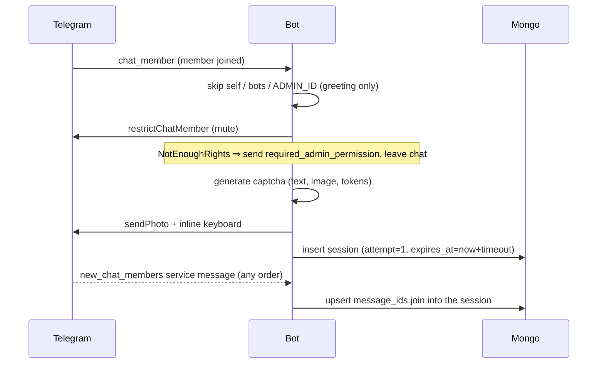

# Protectron — Go Rewrite Architecture

Target state for the Go port of the anti-spam captcha bot. See [plan.md](plan.md) for the phased execution plan.

## Design decisions (agreed)

| Topic | Decision |
|---|---|
| Bot framework | [github.com/go-telegram/bot](https://github.com/go-telegram/bot), long polling |
| Storage | MongoDB (official driver `go.mongodb.org/mongo-driver/v2`) |
| Config scope | Per-chat settings in Mongo, editable via admin commands |
| Join detection | `chat_member` updates as the trigger; `new_chat_members` service message tracked only for cleanup |
| Button hardening | Opaque random callback tokens; token → char mapping lives only in Mongo |
| Captcha charset | Follows chat language: `ru` → Cyrillic subset, `en` → Latin subset |
| Fail policy | Per-chat `max_attempts` (default 2), fresh captcha per attempt; after last attempt kick + per-chat ban duration |
| Timeout policy | Same as fail: kick + per-chat ban duration (no instant unban) |
| Repo layout | Go replaces Python at the repo root; Python removed once port works |

## Package layout

```
cmd/protectron/main.go      wiring: config, logger, mongo, bot, sweeper, shutdown
internal/config/            env parsing (API_TOKEN, MONGO_URI, ADMIN_ID, LOG_LEVEL)
internal/storage/           Mongo repositories: ChatRepo, SessionRepo
internal/captcha/           text generation, image rendering, keyboard/token mapping
internal/i18n/              message templates (templates/*.json, ${var} substitution)
internal/handlers/          telegram handlers: joins, callbacks, admin commands, /ping
internal/sweeper/           periodic expiry scan
templates/                  ru.json, en.json (kept, same ${var} syntax via os.Expand-style mapping)
assets/                     DejaVuSans-Bold.ttf (go:embed-ded into the binary)
```

Single-instance deployment is assumed (long polling); sessions live in Mongo so a restart doesn't drop active captchas — same intent as the old TinyDB store, minus the in-memory mirror.

## MongoDB schema

### `chats` — per-chat settings

```js
{
  _id: <chat_id int64>,
  title: "…",                 // denormalized, refreshed on activity
  lang: "ru",                 // template + charset selection
  captcha_timeout_sec: 300,
  captcha_length: 8,
  max_attempts: 2,
  ban_duration_sec: 60,
  updated_at: ISODate
}
```

Missing chat document ⇒ defaults above with `lang: "ru"`. Documents are created lazily on first join event or first admin command.

### `sessions` — one active captcha per (chat, user)

```js
{
  _id: "<16-hex session id>",       // 8 random bytes, hex
  chat_id: int64,
  user_id: int64,
  answer:  ["д", "ж", …],           // expected press sequence (chars may repeat)
  input:   ["д"],                    // presses so far
  buttons: { "<8-hex token>": "д", … },  // opaque token → char, per-button
  attempt: 1,                        // 1-based, ≤ chat.max_attempts
  message_ids: {                     // everything to delete on completion
    captcha: int,                    // photo+keyboard message
    join:    int                     // join service message, if seen
  },
  expires_at: ISODate,
  created_at: ISODate,
  debug_id: "chatname-(@user)"
}
```

Indexes:

- unique `(chat_id, user_id)` — one active session per user per chat
- `expires_at` — sweeper scan (a plain index, **not** a Mongo TTL index: expiry has side effects — kick, ban, message cleanup — so the sweeper must act before deleting)

## Callback data ("smarter ids")

Old scheme: `btn_<char>` — the answer alphabet is readable straight from the keyboard markup.

New scheme (fits Telegram's 64-byte callback_data limit):

```
c:<session_id>:<token>     char press   e.g. c:9f3a2b1c8d4e5f60:a1b2c3d4
c:<session_id>:bs          backspace
```

- `session_id`: 16 hex chars (crypto/rand), also the Mongo `_id`.
- `token`: 8 hex chars (crypto/rand), unique per button per session. Mapping to the actual character exists **only** in the `sessions.buttons` document — the markup carries no machine-readable answer data.
- Duplicate characters in the answer are harmless: each button has its own token.

Validation order on every callback (cheap → expensive):

1. Parse prefix/shape; garbage ⇒ ignore.
2. Load session by `session_id`; missing ⇒ toast `something_gone_wrong_warn`.
3. `callback.message.id` must equal `session.message_ids.captcha` (rejects replays against stale keyboards after a retry re-send).
4. `from.id` must equal `session.user_id`; else toast `not_for_you_warn`.
5. Token must exist in `session.buttons`; unknown ⇒ ignore.

Button presses for the same session are serialized with an in-process per-session mutex (single instance), and `input` is updated via `findOneAndUpdate` so state can't be corrupted by racing callbacks.

## Captcha generation

- **Charset per language**, confusables excluded:
  - `ru`: `бвгджзиклмнпрстуфцчшщэюя` + `23456789` (drops а/е/о/с/х/у — Latin lookalikes — and soft/hard signs)
  - `en`: `asdfghkzxcvbnmqwertu` + `2345678` (drops i/l/o/j/y and 0/1/9)
- **Text**: `captcha_length` chars sampled with `crypto/rand` (repeats allowed).
- **Image**: [github.com/steambap/captcha](https://github.com/steambap/captcha) with `LoadFont` on a bundled TTF that has Cyrillic glyphs (e.g. DejaVu Sans or Noto Sans **TTF** — the current `NotoSansCJKjp-Regular.otf` is CFF-flavored and may not parse with freetype; verify in the spike, fall back to a `fogleman/gg` custom renderer if quality or parsing disappoints). Noise curves + dots like today.
- **Keyboard**: answer chars shuffled, 2 rows × 4 buttons, plus a `⌫` row. Labels show the characters; callback data is tokens only.

## Flows

### Join



The `new_chat_members` message may arrive before or after the `chat_member` update; the handler only records the message id (upsert), never triggers a captcha.

### Callback press

- **Still inputting** ⇒ toast with current input string.
- **Complete & correct** ⇒ delete session, delete captcha message + join message, unmute (full permissions), send `success_msg`.
- **Complete & wrong, attempts left** ⇒ `attempt++`, delete old captcha message, generate a fresh captcha (new text, image, tokens), send it, reset `input`, reset `expires_at` (full timeout per attempt), toast `fail_msg`.
- **Complete & wrong, last attempt** ⇒ delete session, clean messages, `banChatMember` until `now + ban_duration_sec`, toast `fail_msg`.

### Leave while pending

`chat_member` (member left) with an active session ⇒ delete session, clean tracked messages. If an admin manually unrestricts the user (status change to member/admin without our unmute), cancel the session the same way.

### Sweeper

Every 30 s: `find({expires_at: {$lt: now}})` → for each: kick + ban `ban_duration_sec`, clean messages, delete session. Errors logged per-session, never fatal.

## Admin commands

Sender must be a chat administrator (checked via `getChatMember`; result cached ~5 min per chat+user). All commands work in-group and reply briefly, in the chat's language.

```
/settings                    show current per-chat settings
/set lang ru|en
/set timeout <seconds 60..3600>
/set length <chars 4..10>
/set attempts <1..5>
/set ban <seconds 30..86400>
/ping                        alive check (kept from today, any user)
```

## Usage statistics

Per-chat, per-day counters in a `stats` collection, updated with `$inc` upserts at the moment the event happens (no separate aggregation job):

```js
{
  _id: "<chat_id>:<YYYY-MM-DD>",   // UTC day
  chat_id: int64,
  date: "YYYY-MM-DD",
  joins: 3,            // captcha sessions started
  passed: 2,           // captcha solved
  failed: 1,           // kicked after last wrong attempt
  timeouts: 0,         // kicked by the sweeper
  leaves: 0            // left/removed mid-captcha
}
```

Counter writes are fire-and-forget: a stats failure is logged and never breaks a captcha flow.

Access: the **super admin** (`ADMIN_ID` env — same id that is greeted instead of captcha'd) sends `/stats` to the bot in a **private chat**. Reply: per-chat totals (all time + last 7 days) across all chats the bot serves. Anyone else gets `admins_only_warn`. In-group `/stats` is not offered; the data spans chats, so it belongs to the owner only.

## i18n

`templates/ru.json` and `templates/en.json` are kept as-is; the Mako `${var}` placeholders are substituted with a Go `os.Expand`-style mapper, so the template files need no conversion. New keys needed: `retry_msg` (fresh attempt), `settings_msg`, `set_ok_msg`, `set_bad_value_msg`, `admins_only_warn`.

## Configuration (env)

| Var | Meaning |
|---|---|
| `API_TOKEN` | bot token (required) |
| `MONGO_URI` | e.g. `mongodb://mongo:27017` (required) |
| `MONGO_DB`  | database name, default `protectron` |
| `ADMIN_ID`  | bot owner: greeted instead of captcha'd (optional) |
| `LOG_LEVEL` | slog level, default `info` |

## Deployment

Multi-stage Dockerfile: static build, final stage `scratch` (binary + `templates/` + CA certs; the captcha font is embedded via `go:embed`). The server already runs another bot (`poke_bot`) from the same `docker-compose.yml`, so protectron is added as a sibling service there, reusing the existing `mongodb` (mongo:8.2) service and volume; protectron reads its own `protectron.env` so variable names can't clash with poke_bot's `.env`. Old `db.json` is not migrated — it holds only ephemeral captcha sessions.
